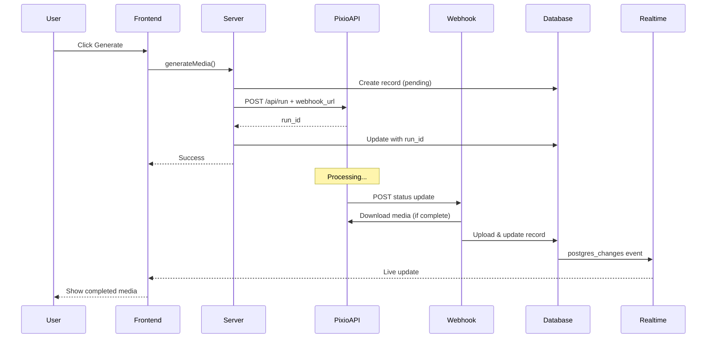

# Pixio API Starter

A modern SaaS subscription starter template with Next.js, Supabase Auth, Stripe, and AI media generation powered by ComfyUI.


<details>
<summary>Overview</summary>

Pixio API Starter is a complete boilerplate for building subscription-based SaaS applications with integrated AI media generation. It includes user authentication, subscription management, a flexible credit system, and a beautiful glassmorphic UI – everything you need to launch your AI-powered SaaS product quickly and efficiently.

</details>

<details>
<summary>Tech Stack</summary>

This project leverages modern technologies for a performant and developer-friendly experience:

- **Frontend Framework**: [Next.js 15](https://nextjs.org/) with App Router and Server Components
- **Authentication & Database**: [Supabase](https://supabase.io/) with Realtime
- **Payments & Subscriptions**: [Stripe](https://stripe.com/)
- **AI Generation**: [ComfyUI](https://comfyui.com/) via [Pixio API](https://api.myapps.ai/) with Webhooks
- **UI Components**: [Shadcn UI](https://ui.shadcn.com/)
- **Styling**: [Tailwind CSS](https://tailwindcss.com/)
- **Animation**: [Framer Motion](https://www.framer.com/motion/)
- **Language**: [TypeScript](https://www.typescriptlang.org/)
- **Form Handling**: [React Hook Form](https://react-hook-form.com/) with [Zod](https://zod.dev/) validation

</details>

<details>
<summary>Features</summary>

- ✅ **User Authentication**: Sign up, login, and user profile management
- ✅ **Subscription Management**: Tiered pricing plans with monthly/yearly billing
- ✅ **Stripe Integration**: Secure payment processing with webhooks and customer portal
- ✅ **Credit System**: Flexible credit-based usage for AI features with purchased packs and subscription allocation
- ✅ **AI Media Generation**: Generate images and videos from text prompts using integrated ComfyUI workflows
- ✅ **Media Library**: View and manage generated media with status tracking and real-time updates
- ✅ **Cancel Generation**: Stop running generations with one click
- ✅ **Responsive Design**: Looks great on all devices
- ✅ **Dark Mode Support**: Light and dark theme options
- ✅ **TypeScript**: Type-safe code for better developer experience
- ✅ **Server Components**: Leverages Next.js 15 server components for improved performance
- ✅ **Row Level Security**: Secure database access with Supabase RLS
- ✅ **Webhook Integration**: Receives real-time status updates from Pixio API
- ✅ **Supabase Realtime**: Live updates for media status and credits without polling
- ✅ **Supabase Storage**: Stores generated media files securely
- ✅ **Cancel Generation**: Ability to cancel running generations

</details>

<details open>
<summary>🚀 Getting Started (For New Forks)</summary>

This section guides you through setting up the project locally after forking the repository.

### Prerequisites

- Node.js 18.0.0 or higher
- npm, yarn, or pnpm
- [Supabase CLI](https://supabase.com/docs/guides/cli) installed globally
- A [Supabase](https://supabase.io/) account
- A [Stripe](https://stripe.com/) account
- A [Pixio API](https://api.myapps.ai/) account (for AI generation)
- [Stripe CLI](https://stripe.com/docs/stripe-cli) (for local webhook testing)
- [ngrok](https://ngrok.com/) (for exposing local webhooks to Pixio API)

### 1. Clone and Install

1.  Fork the repository on GitHub.
2.  Clone your forked repository:

    ```bash
    git clone https://github.your-username.com/yourusername/subscription-starter.git
    cd subscription-starter
    ```
3.  Install dependencies:

    ```bash
    npm install
    # or
    yarn install
    # or
    pnpm install
    ```

### 2. Set up Local Supabase

This project uses Supabase CLI for local development, making it easy to test everything locally before pushing to production.

#### Install Supabase CLI

If you haven't already:

```bash
npm install -g supabase
```

#### Start Local Supabase

1.  **Start local Supabase instance:**
    ```bash
    npx supabase start
    ```
    
    This will:
    - Start a local Postgres database
    - Start Supabase Studio (local dashboard)
    - Run all migrations in `supabase/migrations/`
    - Create the `generated-media` storage bucket
    - Output your local credentials
    
    **Note your local credentials** (especially the `service_role` key for `.env.local`)

2.  **Access Local Studio:**
    - Open http://localhost:54323 to access Supabase Studio locally
    - View your database, run SQL queries, manage storage, etc.

#### Link to Remote Supabase (Optional for Production)

When you're ready to deploy to production:

1.  **Login to Supabase:**
    ```bash
    supabase login
    ```
    
    This opens a browser to authenticate with your Supabase account.

2.  **Create a new project** in the [Supabase Dashboard](https://app.supabase.com/) if you haven't already.

3.  **Link your local project to remote:**
    ```bash
    supabase link --project-ref your-project-ref
    ```
    
    Find your project ref in your Supabase dashboard URL: `https://app.supabase.com/project/your-project-ref`

4.  **Push your local database to remote:**
    ```bash
    supabase db push
    ```
    
    This applies all your local migrations to the remote database.

5.  **Get your remote credentials:**
    - Go to Project Settings > API in your Supabase dashboard
    - Copy the Project URL and `anon` key
    - Copy the `service_role` key
    - Add these to your `.env.local` for production builds

#### Configure Storage Bucket

The `generated-media` bucket is automatically created by the local Supabase setup. For remote Supabase:

1. After running `supabase db push`, go to your remote Supabase dashboard
2. Navigate to Storage
3. The `generated-media` bucket should exist
4. Configure bucket policies:
   - Go to policies
   - Create policy: "Give user access to their own folder"
   - Allow SELECT, INSERT, UPDATE, DELETE for `(storage.foldername(name))[1] = auth.uid()::text`

#### Configure Authentication

1. In Supabase Dashboard, go to Authentication > URL Configuration
2. Set **Site URL** to your application URL:
   - Local: `http://localhost:3000`
   - Production: `https://yourdomain.com`
3. Add redirect URLs:
   - `http://localhost:3000/auth/callback`
   - `https://yourdomain.com/auth/callback` (for production)

### 3. Set up ngrok for Local Webhook Testing

Pixio API needs to send webhooks to your application. For local development, use ngrok to expose your local server:

#### Install ngrok

1.  **Download and install:**
    - Visit [ngrok.com](https://ngrok.com/)
    - Sign up for a free account
    - Download and install ngrok
    - Authenticate: `ngrok authtoken YOUR_AUTH_TOKEN`

2.  **Start ngrok tunnel:**
    ```bash
    ngrok http 3000
    ```
    
    This will output a public URL like: `https://abc123.ngrok-free.app`

3.  **Update your environment:**
    ```env
    # In .env.local, use your ngrok URL for local development
    NEXT_PUBLIC_SITE_URL=https://abc123.ngrok-free.app
    ```

4.  **Configure Pixio Deployments:**
    - Go to your Pixio API dashboard
    - For each deployment, set the webhook URL to:
      `https://abc123.ngrok-free.app/api/webhooks/pixio`

**Important**: Each time you restart ngrok, you'll get a new URL. Update your `.env.local` and Pixio webhook settings accordingly.

**For Production**: Use your actual domain (e.g., `https://yourdomain.com`) instead of ngrok.

### 4. Set up Stripe

You'll set up your products, prices, and webhooks in the Stripe UI.

1.  **Create Products and Prices:**
    *   Log in to the [Stripe Dashboard](https://dashboard.stripe.com/).
    *   Go to Products.
    *   Create your subscription product tiers (e.g., Pro, Business). For each, add both monthly and yearly **Recurring** prices. Note down the **Price IDs**.
    *   Create one-time products for your Credit Packs (e.g., "1000 Credits"). For each, add a **One-time** price. Note down the **Price IDs**.
2.  **Configure Webhook:**
    *   Go to Developers > Webhooks.
    *   Click "Add endpoint".
    *   For local testing, use the Stripe CLI (see step 4 below). Your local webhook URL will look like `http://localhost:3000/api/webhooks/stripe`.
    *   Select the following events to listen for:
        *   `product.created`, `product.updated`, `product.deleted`
        *   `price.created`, `price.updated`, `price.deleted`
        *   `customer.subscription.created`, `customer.subscription.updated`, `customer.subscription.deleted`
        *   `checkout.session.completed`
        *   `invoice.paid`, `invoice.payment_succeeded`
    *   After creating the endpoint, get your **Webhook Signing Secret**.
3.  **Update Price IDs in Code:**
    *   Open `src/lib/config/pricing.ts`.
    *   Update the `STRIPE_PRICE_IDS` object and the `CREDIT_PACKS` array with the actual Price IDs you got from Stripe in step 1.

### 5. Set up Environment Variables (.env.local)

Create a `.env.local` file in the root of your project and add the following variables, using the keys and URLs you obtained from Supabase, Stripe, and Pixio API.

```dotenv
# Supabase
NEXT_PUBLIC_SUPABASE_URL=YOUR_SUPABASE_PROJECT_URL
NEXT_PUBLIC_SUPABASE_ANON_KEY=YOUR_SUPABASE_ANON_KEY
SUPABASE_SERVICE_ROLE_KEY=YOUR_SUPABASE_SERVICE_ROLE_KEY

# Stripe
NEXT_PUBLIC_STRIPE_PUBLISHABLE_KEY=YOUR_STRIPE_PUBLISHABLE_KEY
STRIPE_SECRET_KEY=YOUR_STRIPE_SECRET_KEY
STRIPE_WEBHOOK_SECRET=YOUR_STRIPE_WEBHOOK_SIGNING_SECRET

# Stripe Price IDs (from Stripe Dashboard)
NEXT_PUBLIC_STRIPE_PRICE_PRO_MONTHLY=price_your_pro_monthly_id
NEXT_PUBLIC_STRIPE_PRICE_PRO_YEARLY=price_your_pro_yearly_id
NEXT_PUBLIC_STRIPE_PRICE_BUSINESS_MONTHLY=price_your_business_monthly_id
NEXT_PUBLIC_STRIPE_PRICE_BUSINESS_YEARLY=price_your_business_yearly_id
NEXT_PUBLIC_STRIPE_PRICE_CREDIT_PACK_1000=price_your_1000_credits_price_id
NEXT_PUBLIC_STRIPE_PRICE_CREDIT_PACK_2500=price_your_2500_credits_price_id
NEXT_PUBLIC_STRIPE_PRICE_CREDIT_PACK_5000=price_your_5000_credits_price_id

# Pixio API Configuration (Server-side only - NEVER expose these to client)
COMFY_DEPLOY_API_KEY=YOUR_PIXIO_API_KEY
DEPLOYMENT_ID_KREA_FLUX=3d9bb06d-af94-4247-9c29-b6dc7789f820
DEPLOYMENT_ID_QWEN_EDIT=5a152b3b-2b07-4f9f-81e0-d394b9fbd6a3
DEPLOYMENT_ID_WAN_FIRST_LAST=8c463102-0525-4cf1-8535-731fee0f93b4

# Application URL (Important for redirects and webhooks)
# Use ngrok URL for local development with webhooks
NEXT_PUBLIC_SITE_URL=https://your-ngrok-url.ngrok-free.app
```

### 6. Test Stripe Webhooks

Use the Stripe CLI to forward events to your local development server:

1.  Make sure the Stripe CLI is installed and logged in (`stripe login`).
2.  Run the listen command, forwarding to your local webhook route:

    ```bash
    stripe listen --forward-to http://localhost:3000/api/webhooks/stripe
    ```
3.  The CLI will output a webhook signing secret. **This is different from the one in your Stripe dashboard settings.** Update the `STRIPE_WEBHOOK_SECRET` in your `.env.local` file with this local secret while testing locally. Remember to switch it back to your production secret when deploying.

### 7. Run the Development Server

```bash
npm run dev
# or
yarn dev
# or
pnpm dev
```

Open [http://localhost:3000](http://localhost:3000) in your browser. You should now have the application running locally with authentication, subscription, credit system, and AI generation capabilities connected to your Supabase, Stripe, and Pixio API accounts!

</details>

<details>
<summary>Project Structure</summary>

The project follows a modular structure using the Next.js App Router:

```
/src
  /app
    /(marketing) - Public marketing pages
      /page.tsx - Landing page
      /pricing/page.tsx - Pricing page
      /layout.tsx - Layout for marketing pages
    /(auth) - Authentication pages
      /login/
        /page.tsx - Login page
        /login-form.tsx - Login form component
      /signup/
        /page.tsx - Signup page
        /signup-form.tsx - Signup form component
      /layout.tsx - Layout for auth pages
      /auth/callback/route.ts - Auth callback handler
    /(app) - Auth-protected application pages
      /dashboard/page.tsx - User dashboard
      /account/
        /page.tsx - Account settings page
        /manage-subscription-button.tsx - Client component for subscription management
        /update-profile-form.tsx - Client component for profile updates
        /success-toast.tsx - Toast notification for successful payments
      /premium/page.tsx - Subscription-protected content
      /layout.tsx - Layout for app pages (includes auth check)
    /api - API routes
      /webhooks/stripe/route.ts - Stripe webhook handler
      /create-checkout-session/route.ts - Create checkout session endpoint
      /create-customer-portal/route.ts - Customer portal session endpoint
      /check-session-status/route.ts - Check Stripe session status endpoint
      /purchase-credits/route.ts - Create credit purchase session endpoint
  /components
    /ui - Shadcn UI components
    /account - Account-related components (UpdateProfileForm, ManageSubscriptionButton, CreditPackCard, SuccessToast)
    /dashboard - Dashboard components (MediaGenerationForm, MediaLibrary, MediaCard)
    /shared - Shared components (Navbar, Footer, CreditsDisplay)
    /pricing - Pricing components (PricingClient)
    /checkout - Checkout components (CheckoutModal)
  /lib
    /actions - Server actions (auth, media, stripe)
    /services - Backend services (media.service)
    /storage - Storage helpers (supabase-storage)
    /supabase - Supabase client/server/middleware setup
    /stripe - Stripe client setup
    /validators - Zod validation schemas
    /config - Configuration files (pricing)
    /constants - Constants (media types, costs, deployment IDs)
    /utils.ts - Utility functions
    /theme.ts - Theme configuration
  /middleware.ts - Next.js middleware for auth protection
  /types
    /db_types.ts - Database and entity type definitions
```

</details>

<details>
<summary>Understanding Route Groups and Protection</summary>

This project uses Next.js App Router with three main route groups:

1. `(marketing)` - Public pages accessible to everyone
2. `(auth)` - Authentication pages for login and signup
3. `(app)` - Protected pages requiring authentication

### How Auth Protection Works

Auth protection is implemented at two levels:

1. **Route Group Layout**: The `(app)/layout.tsx` file checks for authentication and redirects unauthenticated users to login:

```tsx
// src/app/(app)/layout.tsx
import { Navbar } from '@/components/shared/navbar';
import { createClient } from '@/lib/supabase/server';
import { redirect } from 'next/navigation';

export default async function AppLayout({
  children,
}: {
  children: React.ReactNode;
}) {
  const supabase = await createClient();
  const { data: { user } } = await supabase.auth.getUser();
  
  if (!user) {
    redirect('/login');
  }
  
  return (
    <div className="flex min-h-screen flex-col">
      <Navbar />
      <main className="flex-1 pt-16 pb-8">
        {children}
      </main>
    </div>
  );
}
```

2. **Middleware**: The `middleware.ts` file in the root directory provides an additional layer of protection:

```typescript
// src/middleware.ts
import { type NextRequest } from 'next/server';
import { updateSession } from '@/lib/supabase/middleware';

export async function middleware(request: NextRequest) {
  return await updateSession(request);
}

export const config = {
  matcher: [
    '/((?!_next/static|_next/image|favicon.ico|.*\\.svg$).*)',
  ],
};
```

The `updateSession` function checks authentication and redirects accordingly:

```typescript
// src/lib/supabase/middleware.ts
import { createServerClient } from '@supabase/ssr';
import { type NextRequest, NextResponse } from 'next/server';
import { Database } from '@/types/db_types';

export async function updateSession(request: NextRequest) {
  let supabaseResponse = NextResponse.next({
    request,
  });

  const supabase = createServerClient<Database>(
    process.env.NEXT_PUBLIC_SUPABASE_URL!,
    process.env.NEXT_PUBLIC_SUPABASE_ANON_KEY!,
    {
      cookies: {
        getAll() {
          return request.cookies.getAll();
        },
        setAll(cookiesToSet) {
          cookiesToSet.forEach(({ name, value, options }) => {
            supabaseResponse.cookies.set(name, value, options);
          });
        },
      },
    }
  );

  // Refresh session
  const { data: { user } } = await supabase.auth.getUser();

  // Optional: Redirect unauthenticated users
  const authPath = request.nextUrl.pathname.startsWith('/login') || 
                   request.nextUrl.pathname.startsWith('/signup') || 
                   request.nextUrl.pathname.startsWith('/auth');
  
  const protectedPaths = ['/dashboard', '/account', '/premium'];
  const isProtectedPath = protectedPaths.some(path => 
    request.nextUrl.pathname.startsWith(path)
  );

  // Redirect unauthenticated users from protected routes to login
  if (!user && isProtectedPath) {
    const redirectUrl = request.nextUrl.clone();
    redirectUrl.pathname = '/login';
    redirectUrl.searchParams.set('from', request.nextUrl.pathname);
    return NextResponse.redirect(redirectUrl);
  }

  // Redirect authenticated users from auth routes to dashboard
  if (user && authPath) {
    const redirectUrl = request.nextUrl.clone();
    redirectUrl.pathname = '/dashboard';
    return NextResponse.redirect(redirectUrl);
  }

  return supabaseResponse;
}
```

</details>

<details>
<summary>How to Add New Pages</summary>

### Adding a Regular Auth-Protected Page

To add a new page that requires authentication:

1. Create a new file in the `(app)` route group:

```tsx
// src/app/(app)/new-page/page.tsx
import { createClient } from '@/lib/supabase/server';

export default async function NewPage() {
  const supabase = await createClient();
  const { data: { user } } = await supabase.auth.getUser();
  
  // The (app) layout already ensures user is authenticated,
  // so you can safely use the user object here
  
  return (
    <div className="container mx-auto px-4 py-8">
      <h1 className="text-3xl font-bold mb-4">New Page</h1>
      <p>Welcome, {user.email}!</p>
      {/* Your page content */}
    </div>
  );
}
```

### Adding a Subscription-Protected Page

To add a page that requires an active subscription:

1. Create a new file in the `(app)` route group:

```tsx
// src/app/(app)/subscribers-only/page.tsx
import { isUserSubscribed, getSubscriptionTier } from '@/lib/supabase/subscriptions';
import { Card, CardContent, CardDescription, CardFooter, CardHeader, CardTitle } from '@/components/ui/card';
import { Button } from '@/components/ui/button';
import Link from 'next/link';

export default async function SubscribersOnlyPage() {
  const subscribed = await isUserSubscribed();
  const tier = await getSubscriptionTier(); // You might also want the tier for specific content

  // Show upgrade prompt if user isn't subscribed
  if (!subscribed) {
    return (
      <div className="container mx-auto px-4 py-16 flex flex-col items-center justify-center">
        <Card className="w-full max-w-md glass-card"> {/* Added glass-card style */}
          <CardHeader className="text-center">
            <CardTitle className="text-2xl">Subscribers Only</CardTitle> {/* Larger title */}
            <CardDescription className="text-base"> {/* Larger description */}
              This content requires an active subscription
            </CardDescription>
          </CardHeader>
          <CardContent className="text-center space-y-4 pb-6"> {/* Increased spacing */}
            <div className="py-6">
              <div className="mx-auto w-20 h-20 rounded-full bg-primary/10 flex items-center justify-center mb-4">
                <svg xmlns="http://www.w3.org/2000/svg" className="h-10 w-10 text-primary" fill="none" viewBox="0 0 24 24" stroke="currentColor">
                  <path strokeLinecap="round" strokeLinejoin="round" strokeWidth={1.5} d="M12 15v2m-6 4h12a2 2 0 002-2v-6a2 2 0 00-2-2H6a2 2 0 00-2 2v6a2 2 0 002 2zm10-10V7a4 4 0 00-8 0v4h8z" />
                </svg>
              </div>
              <p className="text-base text-muted-foreground"> {/* Larger text */}
                Upgrade your account to access premium features and content.
              </p>
            </div>
          </CardContent>
          <CardFooter className="flex justify-center">
            <Button asChild className="w-full glass-button bg-gradient-to-r from-primary to-secondary text-white hover:opacity-95 hover:shadow-lg transition-all duration-300 shadow-md text-lg py-3 font-semibold"> {/* Styled button */}
              <Link href="/pricing">View Plans</Link>
            </Button>
          </CardFooter>
        </Card>
      </div>
    );
  }
  
  return (
    <div className="container mx-auto px-4 py-8">
      <div className="mb-8">
        <h1 className="text-3xl font-bold mb-2">Premium Content</h1>
        <p className="text-muted-foreground">
          Welcome to the premium section! You have access to exclusive content.
        </p>
      </div>
      
      <div className="p-4 mb-8 rounded-lg bg-primary-50 border border-primary-200 text-primary-800">
        <div className="flex gap-3">
          <svg xmlns="http://www.w3.org/2000/svg" className="h-6 w-6 text-primary-500 flex-shrink-0" fill="none" viewBox="0 0 24 24" stroke="currentColor">
            <path strokeLinecap="round" strokeLinejoin="round" strokeWidth={2} d="M9 12l2 2 4-4m5.618-4.016A11.955 11.955 0 0112 2.944a11.955 11.955 0 01-8.618 3.04A12.02 12.02 0 003 9c0 5.591 3.824 10.29 9 11.622 5.176-1.332 9-6.03 9-11.622 0-1.042-.133-2.052-.382-3.016z" />
          </svg>
          <div>
            <h3 className="font-medium">Your Subscription Tier: {tier.toUpperCase()}</h3>
            <p className="text-sm mt-1">
              You have full access to all premium content based on your {tier} subscription.
            </p>
          </div>
        </div>
      </div>
      
      <div className="grid md:grid-cols-2 gap-6">
        {/* Premium Feature 1 */}
        <Card>
          <CardHeader>
            <CardTitle>Advanced Analytics</CardTitle>
            <CardDescription>
              Detailed insights into your data
            </CardDescription>
          </CardHeader>
          <CardContent>
            <div className="aspect-video bg-primary-50 rounded-md flex items-center justify-center">
              <svg xmlns="http://www.w3.org/2000/svg" className="h-16 w-16 text-primary-300" fill="none" viewBox="0 0 24 24" stroke="currentColor">
                <path strokeLinecap="round" strokeLinejoin="round" strokeWidth={1.5} d="M9 19v-6a2 2 0 00-2-2H5a2 2 0 00-2 2v6a2 2 0 002 2h2a2 2 0 002-2zm0 0V9a2 2 0 012-2h2a2 2 0 012 2v10m-6 0a2 2 0 002 2h2a2 2 0 002-2m0 0V5a2 2 0 012-2h2a2 2 0 012 2v14a2 2 0 01-2 2h-2a2 2 0 01-2-2z" />
              </svg>
            </div>
            <p className="mt-4 text-muted-foreground">
              Unlock deep insights with our advanced analytics tools. Track performance, visualize trends, and make data-driven decisions.
            </p>
          </CardContent>
        </Card>
        
        {/* Premium Feature 2 */}
        <Card>
          <CardHeader>
            <CardTitle>Priority Support</CardTitle>
            <CardDescription>
              Get help when you need it most
            </CardDescription>
          </CardHeader>
          <CardContent>
            <div className="aspect-video bg-primary-50 rounded-md flex items-center justify-center">
              <svg xmlns="http://www.w3.org/2000/svg" className="h-16 w-16 text-primary-300" fill="none" viewBox="0 0 24 24" stroke="currentColor">
                <path strokeLinecap="round" strokeLinejoin="round" strokeWidth={1.5} d="M18.364 5.636l-3.536 3.536m0 5.656l3.536 3.536M9.172 9.172L5.636 5.636m3.536 9.192l-3.536 3.536M21 12a9 9 0 11-18 0 9 9 0 0118 0zm-5 0a4 4 0 11-8 0 4 4 0 018 0z" />
              </svg>
            </div>
            <p className="mt-4 text-muted-foreground">
              As a premium member, you receive priority support from our team. Get answers quickly and resolve issues faster.
            </p>
          </CardContent>
        </Card>
        
        {tier === 'business' && (
          // Business-only feature
          <Card className="md:col-span-2">
            <CardHeader>
              <CardTitle>Enterprise Integration</CardTitle>
              <CardDescription>
                Exclusive to Business Plan subscribers
              </CardDescription>
            </CardHeader>
            <CardContent>
              <div className="aspect-video bg-accent-50 rounded-md flex items-center justify-center">
                <svg xmlns="http://www.w3.org/2000/svg" className="h-16 w-16 text-accent-300" fill="none" viewBox="0 0 24 24" stroke="currentColor">
                  <path strokeLinecap="round" strokeLinejoin="round" strokeWidth={1.5} d="M19 21V5a2 2 0 00-2-2H7a2 2 0 00-2 2v16m14 0h2m-2 0h-5m-9 0H3m2 0h5M9 7h1m-1 4h1m4-4h1m-1 4h1m-5 10v-5a1 1 0 011-1h2a1 1 0 011 1v5m-4 0h4" />
                </svg>
              </div>
              <p className="mt-4 text-muted-foreground">
                Connect your enterprise systems and enjoy seamless integration with our platform. This feature is exclusively available to Business Plan subscribers.
              </p>
            </CardContent>
          </Card>
        )}
      </div>
    </div>
  );
}
```

### Adding a Tier-Specific Protected Page

To restrict content to specific subscription tiers (e.g., Business tier only):

```tsx
// src/app/(app)/business-features/page.tsx
import { createClient } from '@/lib/supabase/server';
import { getSubscriptionTier } from '@/lib/supabase/subscriptions';
import { Card, CardContent, CardDescription, CardFooter, CardHeader, CardTitle } from '@/components/ui/card';
import { Button } from '@/components/ui/button';
import Link from 'next/link';

export default async function BusinessFeaturesPage() {
  const tier = await getSubscriptionTier();
  
  // Only allow business tier users
  if (tier !== 'business') {
    return (
      <div className="container mx-auto px-4 py-16 flex flex-col items-center justify-center">
        <Card className="w-full max-w-md glass-card"> {/* Added glass-card style */}
          <CardHeader className="text-center">
            <CardTitle className="text-2xl">Business Plan Required</CardTitle> {/* Larger title */}
            <CardDescription className="text-base"> {/* Larger description */}
              This content requires a Business plan subscription
            </CardDescription>
          </CardHeader>
          <CardContent className="text-center space-y-4"> {/* Increased spacing */}
            <p className="text-base text-muted-foreground"> {/* Larger text */}
              Your current plan: <span className="font-semibold">{tier.toUpperCase()}</span>
            </p>
            <p className="text-base text-muted-foreground"> {/* Larger text */}
              Upgrade to our Business plan to access these features.
            </p>
          </CardContent>
          <CardFooter className="flex justify-center">
            <Button asChild className="w-full glass-button bg-gradient-to-r from-primary to-secondary text-white hover:opacity-95 hover:shadow-lg transition-all duration-300 shadow-md text-lg py-3 font-semibold"> {/* Styled button */}
              <Link href="/pricing">Upgrade Plan</Link>
            </Button>
          </CardFooter>
        </Card>
      </div>
    );
  }
  
  // User has business tier, show the content
  return (
    <div className="container mx-auto px-4 py-8">
      <h1 className="text-3xl font-bold mb-4">Business Features</h1>
      <p className="mb-6">Welcome to the exclusive Business tier features!</p>
      
      {/* Your business-specific content */}
    </div>
  );
}
```

</details>

<details>
<summary>Setting up Supabase</summary>

### 1. Create a Supabase Project

1. Go to [Supabase Dashboard](https://app.supabase.com/) and create a new project
2. Note your project URL and API keys from the project settings
3. Add these to your `.env.local` file

### 2. Database Schema Setup

Run the following SQL in the Supabase SQL Editor to set up your database schema. This includes tables for users, customers, products, prices, subscriptions, credit purchases, credit usage, and generated media.

```sql
-- Create ENUM types for subscription status and pricing details
CREATE TYPE public.subscription_status AS ENUM ('trialing', 'active', 'canceled', 'incomplete', 'incomplete_expired', 'past_due', 'unpaid', 'paused');
CREATE TYPE public.pricing_type AS ENUM ('one_time', 'recurring');
CREATE TYPE public.pricing_plan_interval AS ENUM ('day', 'week', 'month', 'year');

-- USERS Table: Stores public user profile information.
CREATE TABLE public.users (
 id uuid NOT NULL PRIMARY KEY REFERENCES auth.users(id) ON DELETE CASCADE,
 full_name text,
 avatar_url text,
 billing_address jsonb,
 payment_method jsonb,
 -- Credit System Fields
 subscription_credits INTEGER DEFAULT 0,
 purchased_credits INTEGER DEFAULT 0,
 last_credits_reset_date TIMESTAMP WITH TIME ZONE
);
ALTER TABLE public.users ENABLE ROW LEVEL SECURITY;
CREATE POLICY "Allow public read-only access." ON public.users FOR SELECT USING (true);
CREATE POLICY "Can update own user data." ON public.users FOR UPDATE USING (auth.uid() = id);
CREATE POLICY "Can view own user data." ON public.users FOR SELECT USING (auth.uid() = id);

-- Function to automatically create a public user profile when a new auth user signs up
-- This function also initializes credits for the new user
CREATE OR REPLACE FUNCTION public.handle_new_user()
RETURNS trigger
LANGUAGE plpgsql
SECURITY DEFINER SET search_path = public
AS $$
BEGIN
 INSERT INTO public.users (id, full_name, avatar_url, subscription_credits, last_credits_reset_date)
 VALUES (
   new.id,
   new.raw_user_meta_data->>'full_name',
   new.raw_user_meta_data->>'avatar_url',
   -- Initialize with free tier credits (assuming free tier gives 500 credits)
   500,
   timezone('utc'::text, now())
 );
 RETURN new;
END;
$$;

-- Trigger the function after user creation
CREATE TRIGGER on_auth_user_created
 AFTER INSERT ON auth.users
 FOR EACH ROW EXECUTE FUNCTION public.handle_new_user();

-- CUSTOMERS Table: Maps Supabase auth users to Stripe customer IDs. (Accessed via service_role)
CREATE TABLE public.customers (
 id uuid NOT NULL PRIMARY KEY REFERENCES auth.users(id) ON DELETE CASCADE,
 stripe_customer_id text UNIQUE
);
ALTER TABLE public.customers ENABLE ROW LEVEL SECURITY;
-- No policies needed if accessed only via service_role key.

-- PRODUCTS Table: Stores product information synced from Stripe.
CREATE TABLE public.products (
 id text PRIMARY KEY, -- Stripe Product ID
 active boolean,
 name text,
 description text,
 image text,          -- Stripe Product Image URL
 metadata jsonb
);
ALTER TABLE public.products ENABLE ROW LEVEL SECURITY;
CREATE POLICY "Allow public read-only access." ON public.products FOR SELECT USING (true);

-- PRICES Table: Stores price information synced from Stripe.
CREATE TABLE public.prices (
 id text PRIMARY KEY, -- Stripe Price ID
 product_id text REFERENCES public.products(id) ON DELETE CASCADE,
 active boolean,
 description text,
 unit_amount bigint, -- Amount in cents/smallest currency unit
 currency text CHECK (char_length(currency) = 3),
 type public.pricing_type,
 interval public.pricing_plan_interval,
 interval_count integer,
 trial_period_days integer,
 metadata jsonb
);
ALTER TABLE public.prices ENABLE ROW LEVEL SECURITY;
CREATE POLICY "Allow public read-only access." ON public.prices FOR SELECT USING (true);

-- SUBSCRIPTIONS Table: Stores user subscription information synced from Stripe.
CREATE TABLE public.subscriptions (
 id text PRIMARY KEY, -- Stripe Subscription ID
 user_id uuid NOT NULL REFERENCES auth.users(id) ON DELETE CASCADE,
 status public.subscription_status,
 metadata jsonb,
 price_id text REFERENCES public.prices(id),
 quantity integer,
 cancel_at_period_end boolean,
 created timestamp with time zone NOT NULL DEFAULT timezone('utc'::text, now()),
 current_period_start timestamp with time zone NOT NULL DEFAULT timezone('utc'::text, now()),
 current_period_end timestamp with time zone NOT NULL DEFAULT timezone('utc'::text, now()),
 ended_at timestamp with time zone DEFAULT timezone('utc'::text, now()),
 cancel_at timestamp with time zone DEFAULT timezone('utc'::text, now()),
 canceled_at timestamp with time zone DEFAULT timezone('utc'::text, now()),
 trial_start timestamp with time zone DEFAULT timezone('utc'::text, now()),
 trial_end timestamp with time zone DEFAULT timezone('utc'::text, now())
);
ALTER TABLE public.subscriptions ENABLE ROW LEVEL SECURITY;
CREATE POLICY "Can view own subscription data." ON public.subscriptions FOR SELECT USING (auth.uid() = user_id);

-- Create table for credit purchases (records one-time credit pack purchases)
CREATE TABLE public.credit_purchases (
  id UUID PRIMARY KEY DEFAULT gen_random_uuid(),
  user_id UUID NOT NULL REFERENCES auth.users(id) ON DELETE CASCADE,
  amount INTEGER NOT NULL,
  price_id TEXT NOT NULL, -- Stripe Price ID of the credit pack
  created_at TIMESTAMP WITH TIME ZONE NOT NULL DEFAULT now()
);
ALTER TABLE public.credit_purchases ENABLE ROW LEVEL SECURITY;
CREATE POLICY "Can view own credit purchases" ON public.credit_purchases FOR SELECT USING (auth.uid() = user_id);

-- Create table for credit usage (records when credits are spent)
CREATE TABLE public.credit_usage (
  id UUID PRIMARY KEY DEFAULT gen_random_uuid(),
  user_id UUID NOT NULL REFERENCES auth.users(id) ON DELETE CASCADE,
  amount INTEGER NOT NULL, -- Amount of credits used (negative value)
  description TEXT, -- Description of usage (e.g., "Generated image")
  created_at TIMESTAMP WITH TIME ZONE NOT NULL DEFAULT now()
);
ALTER TABLE public.credit_usage ENABLE ROW LEVEL SECURITY;
CREATE POLICY "Can view own credit usage" ON public.credit_usage FOR SELECT USING (auth.uid() = user_id);

-- Table for storing generated media
CREATE TABLE public.generated_media (
  id UUID PRIMARY KEY DEFAULT gen_random_uuid(),
  user_id UUID NOT NULL REFERENCES auth.users(id) ON DELETE CASCADE,
  prompt TEXT NOT NULL,
  media_type TEXT NOT NULL CHECK (media_type IN ('image', 'video')), -- Add other types here if needed
  media_url TEXT NOT NULL, -- Public URL in storage
  storage_path TEXT NOT NULL, -- Path in storage bucket
  credits_used INTEGER NOT NULL,
  status TEXT NOT NULL DEFAULT 'pending', -- pending, processing, completed, failed
  created_at TIMESTAMP WITH TIME ZONE NOT NULL DEFAULT now(),
  metadata JSONB DEFAULT NULL -- Store ComfyUI run_id, error messages, etc.
);
ALTER TABLE public.generated_media ENABLE ROW LEVEL SECURITY;
CREATE POLICY "Can view own media" ON public.generated_media FOR SELECT USING (auth.uid() = user_id);
CREATE POLICY "Can insert own media" ON public.generated_media FOR INSERT WITH CHECK (auth.uid() = user_id);
CREATE POLICY "Can update own media" ON public.generated_media FOR UPDATE USING (auth.uid() = user_id);
-- Policy for service role to update status/url/path
CREATE POLICY IF NOT EXISTS "Allow service role to update media" 
  ON public.generated_media 
  FOR UPDATE 
  USING (true)
  WITH CHECK (true);

```

### 3. Authentication Settings

1. Go to Authentication > URL Configuration
2. Set Site URL to your application URL (e.g., `http://localhost:3000` for development)
3. Add a redirect URL: `http://localhost:3000/auth/callback` (add your production URL as well when deploying)
4. Configure email templates if desired

### 4. Create Supabase Storage Bucket

You need a storage bucket to store the generated images and videos.

1. Go to Storage in your Supabase project dashboard.
2. Click "New bucket".
3. Name the bucket `generated-media`.
4. **Important:** Decide on Public vs. Private access.
   - **Public:** Generated media URLs will be publicly accessible without authentication. This is simpler for display but means anyone with the URL can view the media.
   - **Private:** Generated media requires authentication to view. This is more secure but requires signing URLs on the server before displaying them in the frontend. The current implementation assumes **Public** access for simplicity in fetching the `media_url` directly. If you need private storage, you'll need to modify the `MediaCard` component to generate signed URLs.
5. Click "Create bucket".
6. Go to policies and create a new policy "Give user access to their own top level folder named uid" and allow SELECT, INSERT, UPDATE, DELETE.

### 5. Configure Pixio API Webhooks

This project uses a webhook-based architecture with Supabase Realtime for instant updates.

#### How the Webhook Architecture Works

1. **Client initiates generation**: The user submits a generation request from the frontend
2. **Server calls Pixio API**: The Next.js server action calls Pixio API with a `webhook_url` parameter pointing to your application
3. **Pixio processes in background**: Pixio API processes the generation and sends status updates to your webhook
4. **Webhook updates database**: Your webhook endpoint receives updates, downloads completed media, and updates the database
5. **Realtime updates frontend**: Supabase Realtime instantly pushes database changes to the frontend
6. **User sees live updates**: No polling needed - the UI updates immediately when generation completes

#### Setting Up the Webhook

1. **Configure Webhook URL:**
   - Your webhook endpoint is automatically available at `/api/webhooks/pixio`
   - For local development with Pixio webhooks, you'll need to expose your local server using a tool like [ngrok](https://ngrok.com/) or [localtunnel](https://localtunnel.github.io/www/)
   - Example with ngrok: `ngrok http 3000` then use the provided URL (e.g., `https://abc123.ngrok.io/api/webhooks/pixio`)
   - For production, use your actual domain (e.g., `https://yourapp.com/api/webhooks/pixio`)

2. **Configure Deployment IDs:**
   - Get your deployment IDs from the Pixio API dashboard for each workflow type
   - Add them to your `.env.local` file:
     ```env
     NEXT_PUBLIC_DEPLOYMENT_ID_IMAGE=your_image_deployment_id
     NEXT_PUBLIC_DEPLOYMENT_ID_VIDEO=your_video_deployment_id
     NEXT_PUBLIC_DEPLOYMENT_ID_FIRST_LAST_FRAME_VIDEO=your_keyframe_deployment_id
     ```

3. **Update Constants:**
   - The deployment IDs in `src/lib/constants/media.ts` read from environment variables
   - Ensure these match your Pixio deployments

#### Webhook Security

The webhook endpoint validates requests by:
- Checking for the presence of required fields (`run_id`, `status`)
- Verifying the media record exists in your database
- Only processing updates for records that exist

For additional security in production, consider:
- Adding IP whitelist for Pixio's webhook servers
- Implementing request signing verification if Pixio provides it
- Rate limiting the webhook endpoint

### 1. Create Stripe Products and Prices

1. Log in to the [Stripe Dashboard](https://dashboard.stripe.com/)
2. Go to Products > Add Product
3. Create your product tiers (e.g., Free, Pro, Business)
4. For each **paid** product, add pricing plans:
   - Create both monthly and yearly **Recurring** prices.
   - Set the appropriate prices.
   - Note the **Price IDs** (e.g., `price_1234567890`) for each plan.
5. Create **one-time** products for your Credit Packs (e.g., "1000 Credits").
6. For each Credit Pack product, add a **One-time** price.
7. Note the **Price IDs** for each credit pack.

### 2. Configure Stripe Webhook

1. In Stripe Dashboard, go to Developers > Webhooks
2. Add an endpoint with your webhook URL:
   - For production: `https://your-domain.com/api/webhooks/stripe`
   - For local development, use Stripe CLI (see step 4 below in Getting Started).
3. Select events to listen for:
   - `product.created`, `product.updated`, `product.deleted`
   - `price.created`, `price.updated`, `price.deleted`
   - `customer.subscription.created`, `customer.subscription.updated`, `customer.subscription.deleted`
   - `checkout.session.completed` (Crucial for both subscriptions and one-time credit purchases)
   - `invoice.paid`, `invoice.payment_succeeded` (Important for subscription renewals)
4. After creating the endpoint, get your **Webhook Signing Secret** and add it to your `.env.local` file as `STRIPE_WEBHOOK_SECRET`.

### 3. Update Price IDs in Config

Open `src/lib/config/pricing.ts` and update the `STRIPE_PRICE_IDS` and `CREDIT_PACKS` with your actual Stripe Price IDs from step 1.

```typescript
// src/lib/config/pricing.ts
export interface PricingTier {
  id: 'free' | 'pro' | 'business';
  name: string;
  description: string;
  features: string[];
  popular: boolean;
  credits: number; // Added credits field
  // Each tier can have monthly and yearly pricing options
  pricing: {
    monthly: {
      priceId: string | null; // Stripe Price ID
      amount: number | null;  // Amount in cents
    };
    yearly: {
      priceId: string | null; // Stripe Price ID
      amount: number | null;  // Amount in cents
      discount?: number;      // Optional percentage discount compared to monthly
    };
  };
}

// Read price IDs from environment variables
export const STRIPE_PRICE_IDS = {
  PRO_MONTHLY: process.env.NEXT_PUBLIC_STRIPE_PRICE_PRO_MONTHLY || '',
  PRO_YEARLY: process.env.NEXT_PUBLIC_STRIPE_PRICE_PRO_YEARLY || '',
  BUSINESS_MONTHLY: process.env.NEXT_PUBLIC_STRIPE_PRICE_BUSINESS_MONTHLY || '',
  BUSINESS_YEARLY: process.env.NEXT_PUBLIC_STRIPE_PRICE_BUSINESS_YEARLY || '',
  // Credit pack price IDs
  CREDIT_PACK_1000: process.env.NEXT_PUBLIC_STRIPE_PRICE_CREDIT_PACK_1000 || '',
  CREDIT_PACK_2500: process.env.NEXT_PUBLIC_STRIPE_PRICE_CREDIT_PACK_2500 || '',
  CREDIT_PACK_5000: process.env.NEXT_PUBLIC_STRIPE_PRICE_CREDIT_PACK_5000 || '',
};

// Define credit packs for purchase
export const CREDIT_PACKS = [
  {
    id: 'credits-1000',
    name: '1000 Credits',
    description: 'Top up with a small credit pack',
    amount: 1000, // Number of credits
    price: 1000, // Price in cents ($10.00)
    priceId: STRIPE_PRICE_IDS.CREDIT_PACK_1000,
  },
  // ... other credit packs
];

// Check if price IDs are configured
const isPricingConfigured = () => {
  return (
    STRIPE_PRICE_IDS.PRO_MONTHLY &&
    STRIPE_PRICE_IDS.PRO_YEARLY &&
    STRIPE_PRICE_IDS.BUSINESS_MONTHLY &&
    STRIPE_PRICE_IDS.BUSINESS_YEARLY
  );
};

// Show warning if price IDs are not configured in production
if (process.env.NODE_ENV === 'production' && !isPricingConfigured()) {
  console.warn('Warning: Stripe price IDs are not configured in environment variables.');
}

export const PRICING_TIERS: PricingTier[] = [
  {
    id: 'free',
    name: 'Free',
    description: 'Essential features for individuals',
    credits: 500, // 500 credits for free tier
    features: [
      'Basic dashboard access',
      'Limited access to features',
      'Community support',
      '500 credits per month',
    ],
    popular: false,
    pricing: {
      monthly: {
        priceId: null,
        amount: null,
      },
      yearly: {
        priceId: null,
        amount: null,
      },
    },
  },
  {
    id: 'pro',
    name: 'Pro',
    description: 'Perfect for professionals',
    credits: 3000, // 3000 credits for pro tier
    features: [
      'Everything in Free',
      'Advanced features',
      'Priority support',
      'Extended usage limits',
      '3000 credits per month',
    ],
    popular: true,
    pricing: {
      monthly: {
        priceId: STRIPE_PRICE_IDS.PRO_MONTHLY || null,
        amount: 2900, // $29/month
      },
      yearly: {
        priceId: STRIPE_PRICE_IDS.PRO_YEARLY || null,
        amount: 29000, // $290/year
        discount: 16,  // 16% discount compared to monthly
      },
    },
  },
  {
    id: 'business',
    name: 'Business',
    description: 'For teams and organizations',
    credits: 6000, // 6000 credits for business tier
    features: [
      'Everything in Pro',
      'Advanced features', // Updated from 'Everything in Pro' for clarity
      'Dedicated support',
      'Custom integrations',
      'Team management',
      '6000 credits per month',
    ],
    popular: false, // Changed to false as Pro is marked popular
    pricing: {
      monthly: {
        priceId: STRIPE_PRICE_IDS.BUSINESS_MONTHLY || null,
        amount: 5900, // $59/month
      },
      yearly: {
        priceId: STRIPE_PRICE_IDS.BUSINESS_YEARLY || null,
        amount: 59000, // $590/year
        discount: 16,  // 16% discount compared to monthly
      },
    },
  },
];


// Helper function to get a tier by ID
export function getTierById(id: string): PricingTier | undefined {
  return PRICING_TIERS.find(tier => tier.id === id);
}

// Build a mapping of price IDs to tier information for easy lookup
export type PriceIdInfo = {
  tierId: 'free' | 'pro' | 'business';
  interval: 'monthly' | 'yearly';
};

// Create a map of price IDs to tier info
export const PRICE_ID_MAP: Record<string, PriceIdInfo> = {};

// Populate the price ID map
PRICING_TIERS.forEach(tier => {
  // Add monthly price ID if exists
  if (tier.pricing.monthly.priceId) {
    PRICE_ID_MAP[tier.pricing.monthly.priceId] = {
      tierId: tier.id as 'free' | 'pro' | 'business',
      interval: 'monthly'
    };
  }

  // Add yearly price ID if exists
  if (tier.pricing.yearly.priceId) {
    PRICE_ID_MAP[tier.pricing.yearly.priceId] = {
      tierId: tier.id as 'free' | 'pro' | 'business',
      interval: 'yearly'
    };
  }
});

// Helper function to get tier info from a price ID
export function getTierByPriceId(priceId: string | null | undefined): { 
  tier: PricingTier | undefined, 
  interval: 'monthly' | 'yearly' | undefined 
} {
  if (!priceId) {
    // Default to free tier with no interval
    const freeTier = getTierById('free');
    return { tier: freeTier, interval: undefined };
  }

  const priceInfo = PRICE_ID_MAP[priceId];

  if (!priceInfo) {
    // Price ID not found in our configuration
    return { tier: undefined, interval: undefined };
  }

  const tier = getTierById(priceInfo.tierId);

  return { 
    tier,
    interval: priceInfo.interval
  };
}
```

2. Ensure you update the `STRIPE_PRICE_IDS` in the same file with your actual Stripe price IDs.

3. The pricing page itself is in `src/app/(marketing)/pricing/page.tsx` and uses the client component `PricingClient` which you can customize.

### Modifying the Dashboard

Edit `src/app/(app)/dashboard/page.tsx` and the components within `src/components/dashboard` (`media-generation-form.tsx`, `media-library.tsx`) to change the dashboard layout, add new cards, or modify existing components. These files have been significantly updated in the previous steps to match the glassmorphic theme.

### Modifying the Account Page

Edit `src/app/(app)/account/page.tsx` and the components within `src/components/account` (`update-profile-form.tsx`, `manage-subscription-button.tsx`, `credit-pack-card.tsx`) to change the account page layout and styling. These files have been significantly updated in the previous steps to match the glassmorphic theme.

</details>

<details>
<summary>Credit System</summary>

This project includes a robust credit system that allows users to consume credits for various AI generation actions. Each subscription tier includes a monthly allocation of credits, and users can purchase additional credit packs.

### How the Credit System Works

- **Tier-Based Credits**: Each subscription tier (free, pro, business) comes with a monthly allocation of credits defined in `src/lib/config/pricing.ts`.
- **Credit Refresh**: Subscription credits are automatically refreshed to the tier's allocation amount when a subscription becomes `active` or `trialing`, or when it renews (handled by the Stripe webhook).
- **Two Credit Types**:
  - **Subscription Credits**: Reset monthly based on the user's subscription tier.
  - **Purchased Credits**: Never expire and accumulate as users buy credit packs.
- **Credit Usage**: When users consume credits (e.g., generating an image), the system first uses `subscription_credits` before using `purchased_credits`. Usage is recorded in the `credit_usage` table.

### Setting Up the Credit System

Setup involves adding fields and tables to your database schema (covered in [Database Schema Setup](#database-schema-setup)) and configuring credit amounts in `src/lib/config/pricing.ts` (covered in [Update Price IDs in Config](#update-price-ids-in-config)).

### Using the Credit System

- **Displaying Credits**: The user's total credits are displayed in the navigation bar using the `CreditsDisplay` component (`src/components/shared/credits-display.tsx`). The total shown combines both subscription and purchased credits.
- **Managing Credits**: The account page (`src/app/(app)/account/page.tsx`) includes a dedicated credits section where users can view their balances and recent usage.
- **Purchasing Credits**: Users can purchase additional credit packs from the account page. This triggers a Stripe one-time payment checkout session. The Stripe webhook handles adding the purchased credits to the user's `purchased_credits` balance upon successful payment (`src/app/api/webhooks/stripe/route.ts`).
- **Programmatically Using Credits**: The `useCredits` function in `src/lib/credits.ts` is used by server actions (like `generateMedia`) to deduct credits from the user's balance and record the usage.

```typescript
// Example of using credits in a server action
import { useCredits } from '@/lib/credits';

export async function myServerAction() {
  const userId = '...'; // Get the user ID (e.g., from auth.getUser())
  const amount = 50; // Number of credits to use
  const description = 'Generated AI image'; // What the credits were used for

  // Attempt to use credits
  const success = await useCredits(userId, amount, description);

  if (success) {
    // Credits were successfully used, perform the action (e.g., trigger AI generation)
    console.log("Credits used successfully!");
    return { success: true };
  } else {
    // Not enough credits
    console.error("Not enough credits!");
    return { error: 'Not enough credits' };
  }
}
```

### Troubleshooting the Credit System

If users report issues with credits not being added after purchase or not resetting:

1. **Check Stripe Webhooks**: Ensure the webhook endpoint is correctly set up in Stripe and receiving events (especially `checkout.session.completed` for credit packs and `customer.subscription.updated`, `invoice.paid` for subscription renewals).
2. **Verify Webhook Signatures**: Make sure your `STRIPE_WEBHOOK_SECRET` environment variable is correct and matches the secret in your Stripe webhook settings.
3. **Check Supabase Function Logs**: The `generate-media-handler` function logs errors related to credit deduction. Check the Supabase Function logs for issues.
4. **Check Stripe Webhook Logs**: The Stripe dashboard provides logs for each webhook delivery attempt, showing the request, response, and any errors.
5. **Check Supabase Database Logs**: Monitor your Supabase database logs for errors during credit updates (`public.users` table) or purchase/usage inserts (`public.credit_purchases`, `public.credit_usage`).
6. **Manually Add Credits**: If needed for testing or support, you can manually add credits using the Supabase SQL Editor:

   ```sql
   -- Add 1000 purchased credits to a specific user
   UPDATE public.users
   SET purchased_credits = purchased_credits + 1000
   WHERE id = 'user-uuid-here';

   -- Reset subscription credits for a specific user to their tier's amount (e.g., Pro tier = 3000)
   UPDATE public.users
   SET subscription_credits = 3000, -- Replace 3000 with the correct tier amount
       last_credits_reset_date = timezone('utc'::text, now())
   WHERE id = 'user-uuid-here';
   ```

</details>

<details>
<summary>Architecture: Webhook + Realtime</summary>

### How It Works

The application uses a modern webhook-based architecture with Supabase Realtime for instant UI updates:



### Key Benefits

1. **No Polling**: Frontend receives instant updates via Realtime
2. **Simpler Architecture**: No need for Edge Functions or polling loops
3. **Better UX**: Immediate feedback when generation completes
4. **Lower Costs**: Fewer function invocations and database queries
5. **Reliable**: Webhooks ensure updates are received even if client disconnects

### Real-time Features

The application uses Supabase Realtime subscriptions for:

1. **Media Library** (`src/components/dashboard/media-library.tsx`):
   - Listens to `generated_media` table changes
   - Automatically updates when new media is generated
   - Shows status changes in real-time

2. **Credits Display** (`src/components/shared/credits-display.tsx`):
   - Listens to `users` table changes
   - Updates immediately when credits are used or purchased
   - No manual refresh needed

3. **Generation Form** (`src/components/dashboard/media-generation-form.tsx`):
   - Subscribes to specific media record during generation
   - Shows live preview when generation completes
   - Displays errors immediately

</details>

<details>
<summary>Adding Pixio API Deployments and Modalities</summary>

The application supports generating different types of media (modalities) using ComfyUI workflows deployed via the Pixio API. This section explains how to add new modalities or update existing ones.

### Adding New Pixio Models

To add new Pixio API models to your application:

1. **Add model definition** to [`src/lib/pixio-api.ts`](src/lib/pixio-api.ts):

```typescript
// Define the input type
export interface YourModelInputs {
  prompt: string;
  // ... other inputs
}

// Create the model definition
export const YOUR_MODEL: PixioModel<YourModelInputs> = {
  id: 'your-model-id',
  name: 'Your Model Name',
  description: 'Description of what this model does',
  deploymentId: process.env.DEPLOYMENT_ID_YOUR_MODEL || 'default-id',
  category: 'image', // or 'video' or 'edit'
  creditCost: 20,
  inputSchema: {
    prompt: {
      type: 'string',
      required: true,
      description: 'Text prompt'
    }
    // ... define all inputs
  }
};

// Add to PIXIO_MODELS
export const PIXIO_MODELS = {
  // ... existing models
  yourModel: YOUR_MODEL
} as const;
```

2. **Add environment variable** to `.env.local`:
```env
DEPLOYMENT_ID_YOUR_MODEL=your_deployment_id_from_pixio
```

3. **Update generation logic** in [`src/lib/actions/media.actions.ts`](src/lib/actions/media.actions.ts) to handle the new model.

4. **Update UI** to expose the new model option to users.

</details>

<details>
<summary>Styling the App</summary>

This project uses [Tailwind CSS](https://tailwindcss.com/) for utility-first styling and a custom theme defined using CSS variables in `src/app/globals.css`.

### Tailwind CSS

Tailwind classes are used directly in JSX components (`className` prop) to apply styles. The `tailwind.config.ts` file extends the default Tailwind theme with custom colors (using OKLCH for perceptual uniformity), border radii, and keyframes for animations.

Key styling concepts used:

- **Utility Classes:** Classes like `flex`, `grid`, `p-4`, `text-lg`, `font-bold`, `bg-primary`, `text-white`, `rounded-md`, `shadow-lg`, `transition`, `duration-300`, `hover:opacity-90`, `dark:bg-black/50`, `backdrop-blur-md`.
- **Custom Colors:** Defined in `tailwind.config.ts` and used via classes like `bg-primary`, `text-secondary`, `border-accent/20`.
- **Custom Utility Classes:** Defined in `src/app/globals.css` using `@layer components` for reusable styles like `glass-card`, `glass-input`, `glass-button`.
- **CSS Variables:** Used in `src/app/globals.css` (`:root`, `.dark`) to define the color palette and other theme values, which are then referenced by Tailwind classes or direct CSS. This allows for easy theme switching (light/dark mode).
- **Animations:** Custom keyframes (`@keyframes`) and Tailwind animation classes (`animation-*`) are defined in `tailwind.config.ts` and used for subtle effects like floating elements, gradient movement, and pulse.

**Example Custom Component Class (`.glass-card`)**:

```css
/* src/app/globals.css */
@layer components {
  .glass-card {
    @apply rounded-xl bg-white/20 dark:bg-black/20 backdrop-blur-md border border-white/20 dark:border-white/10 shadow-lg hover:shadow-xl transition-shadow;
  }
  /* ... other custom classes ... */
}
```
This allows you to apply a complex, consistent style across multiple elements simply by adding the `glass-card` class.

By modifying `tailwind.config.ts` and `src/app/globals.css`, you can easily adjust the visual appearance of the entire application, update the color palette, change border styles, or add new reusable components and animations.

</details>

<details>
<summary>Deployment</summary>

### Deploying to Vercel

1. Push your code to a GitHub repository.
2. Sign up for [Vercel](https://vercel.com) and import your repository.
3. Set the environment variables in the Vercel dashboard. **Make sure to set ALL variables from your `.env.local`, including the Stripe price IDs and the Pixio API Key.**
4. Deploy the project.

After deployment, update your Supabase and Stripe configurations with your production URL:
1. Update the Site URL and redirect URLs in Supabase Auth settings.
2. Update the webhook endpoint URL in Stripe.
3. Update the `NEXT_PUBLIC_SITE_URL` environment variable in Vercel to your production domain.

</details>

<details>
<summary>Acknowledgments</summary>

- [Next.js](https://nextjs.org/)
- [Supabase](https://supabase.io/)
- [Stripe](https://stripe.com/)
- [Shadcn UI](https://ui.shadcn.com/)
- [ComfyUI](https://comfyui.com/)
- [Pixio API](https://api.myapps.ai/)
- [Framer Motion](https://www.framer.com/motion/)

</details>
