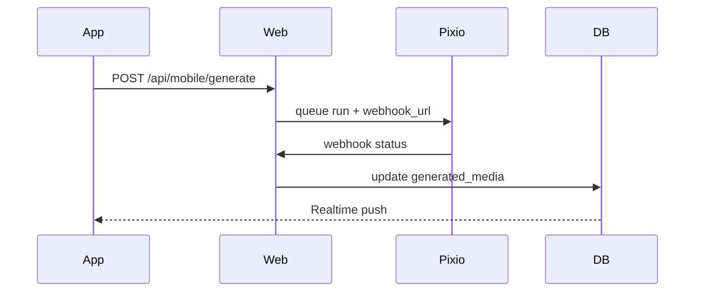

# Pixio API Starter — Monorepo

A pnpm + Turborepo monorepo for building subscription SaaS with AI media generation (Pixio API webhooks), Stripe billing, Supabase auth, a Next.js web app, and an Expo mobile app.


## What's in the repo

| Path | Description |
|------|-------------|
| `apps/web` | Next.js 15 dashboard, marketing, Stripe/Pixio webhooks, mobile API |
| `apps/mobile` | Expo app — Generate, Assets, Settings + native Stripe |
| `packages/config` | Pricing tiers, credit packs |
| `packages/database` | Supabase types + queries |
| `packages/credits` | Credit ledger |
| `packages/billing` | Stripe checkout, webhooks, native PaymentSheet |
| `packages/generation` | Pixio client, queueGeneration, webhook processor |

See **[AGENTS.md](./AGENTS.md)** for agent/developer conventions.

## Quick start

**Prerequisites:** Node ≥ 20.19, pnpm 10+, Supabase CLI, Stripe account, Pixio API key.

```bash
pnpm install
cp apps/web/env.example apps/web/.env.local   # fill in keys
pnpm --filter @pixio/web supabase:start
pnpm dev:web
```

Open [http://localhost:3000](http://localhost:3000).

For local Pixio webhooks, expose the web app with [ngrok](https://ngrok.com/) and set `NEXT_PUBLIC_SITE_URL` to your tunnel URL. Point Pixio deployment webhooks to `{SITE_URL}/api/webhooks/pixio`.

## Scripts

    ```bash
pnpm dev              # web + mobile in parallel
pnpm dev:web          # Next.js only
pnpm dev:mobile       # Expo only
pnpm typecheck        # all packages
pnpm test             # unit tests
pnpm build            # production build
```

## Mobile app

**Uses a development build — not Expo Go.** Native Stripe and SDK 56 require `expo-dev-client`.

```bash
cp apps/mobile/.env.example apps/mobile/.env.local   # set EXPO_PUBLIC_API_URL to LAN IP
pnpm install
pnpm --filter @pixio/mobile prebuild
pnpm --filter @pixio/mobile android   # or ios — builds & installs dev client
```

Day-to-day: `pnpm dev:mobile` (Metro with `--dev-client`), then press `a` / `i`.

| Topic | Doc |
|-------|-----|
| Full mobile guide (icons, Metro, troubleshooting) | [apps/mobile/README.md](./apps/mobile/README.md) |
| Web library + result preview / Realtime | [docs/web-dashboard-realtime.md](./docs/web-dashboard-realtime.md) |

## Architecture

Generation uses **webhooks**, not edge functions:

1. Client calls `queueGeneration` (web server action or mobile API)
2. Pixio processes async and POSTs to `/api/webhooks/pixio`
3. Webhook downloads media, updates Supabase
4. UI updates via Supabase Realtime


```mermaid
sequenceDiagram
    participant App
    participant Web
    participant Pixio
    participant DB
    App->>Web: POST /api/mobile/generate
    Web->>Pixio: queue run + webhook_url
    Pixio->>Web: webhook status
    Web->>DB: update generated_media
    DB-->>App: Realtime push
```

## Testing

- **Packages**: Vitest (`pnpm test`)
- **Web**: Vitest + Playwright scaffold (`apps/web/e2e`)
- **Mobile**: Jest + Maestro smoke flow

## Docs

- [Pixio API](https://pixio-api-docs.vercel.app/docs/api)
- [AGENTS.md](./AGENTS.md) — monorepo rules for contributors and AI agents
- [apps/mobile/README.md](./apps/mobile/README.md) — Expo dev build, icons, Metro/Supabase, troubleshooting
- [docs/web-dashboard-realtime.md](./docs/web-dashboard-realtime.md) — web library & result preview sync
- Full web setup: `apps/web/env.example` and historical README sections for `apps/web`

## Deploy

Deploy `apps/web` to Vercel with all env vars from `apps/web/env.example`. Mobile apps use `EXPO_PUBLIC_API_URL` pointing at your production web URL.
